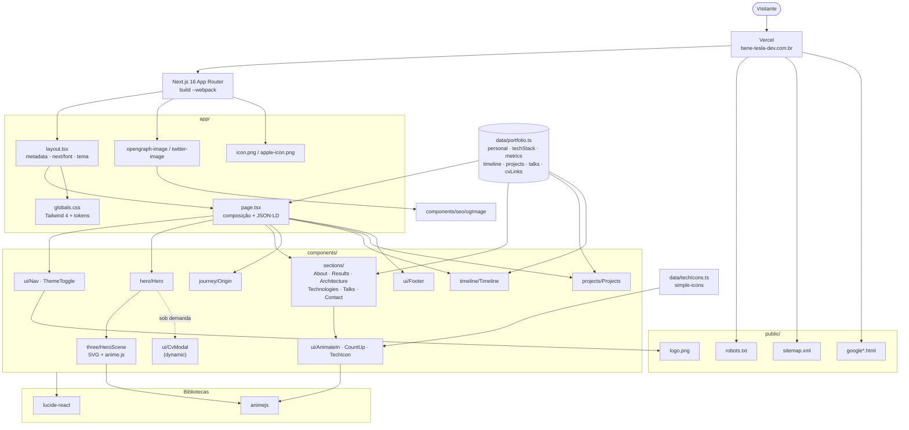

# Portfólio — Benevanio Santos

Site de portfólio profissional de **Benevanio Santos**, Engenheiro de Software Full Stack & Desktop. Apresenta, em uma narrativa visual única, a trajetória profissional, a experiência corporativa, os princípios de arquitetura, a stack técnica, os projetos e as formas de contato.

A experiência foi pensada para o visitante entender rapidamente a sequência:

**quem sou → minha experiência → o que construí → minhas especialidades → minha stack → minha evolução profissional → como entrar em contato.**

## Sobre o projeto

Aplicação web de página única (single page), construída com **Next.js (App Router)** e renderização estática. Todo o conteúdo (dados pessoais, métricas, linha do tempo, projetos, princípios e currículos) é centralizado em um único arquivo de dados, facilitando a manutenção sem tocar na interface.

O design segue uma identidade sóbria e técnica — tipografia forte, hierarquia clara, tema claro/escuro e uma paleta inspirada na origem nordestina do autor. As animações comunicam **precisão, tecnologia e arquitetura**, sem exageros.

## Stack

| Camada | Tecnologia |
| --- | --- |
| Framework | Next.js 16 (App Router) + React 19 |
| Linguagem | TypeScript |
| Estilo | Tailwind CSS 4 + CSS variables (tema claro/escuro) |
| Animações | [Anime.js](https://animejs.com/) 4 |
| Logos de tecnologias | [Simple Icons](https://simpleicons.org/) |
| Ícones de interface | lucide-react |
| Fontes | Outfit + Public Sans (`next/font/google`) |

## Funcionalidades

- **Hero** com backdrop SVG animado (malha de conexão inspirada em API-Led) e entrada em _stagger_.
- **Métricas** com contagem progressiva ao entrar em tela (25+ integrações MuleSoft, 100+ sistemas monitorados, performance, disponibilidade etc.).
- **Origem** — a trajetória geográfica do Nordeste até a engenharia de software.
- **Linha do tempo** profissional e acadêmica, com desenho progressivo da linha.
- **Princípios de arquitetura** (DDD, Event-Driven, Clean Code, SOLID, API-Led).
- **Stack técnica** com **logos oficiais** das marcas via Simple Icons e microinterações de hover.
- **Palestras** (GDG Americana, Arapiraca e Aracaju) com link para cada apresentação.
- **Projetos** com tipo, arquitetura, stack e link para o GitHub.
- **Contato** com agenda, e-mail, LinkedIn, GitHub e WhatsApp.
- **Modal de currículos** por especialidade (Java, Node.js, MuleSoft, Full Stack, Front-End, Suporte).
- **Tema claro/escuro** com persistência em `localStorage` e detecção da preferência do sistema.

## Acessibilidade e performance

- Respeita `prefers-reduced-motion`: todas as animações têm fallback estático.
- _Skip link_, `aria-label`s, foco visível e contraste ajustado por tema.
- Backdrop e logos em SVG leve; animações baseadas em `opacity`/`transform` para renderização fluida.
- Página pré-renderizada como conteúdo estático.

## Estrutura

```
app/
  layout.tsx          Metadados, fontes, tema inicial e estilos globais
  icon.png, apple-icon.png   Favicon (logo)
  opengraph-image.tsx, twitter-image.tsx   Imagens de compartilhamento
  page.tsx            Composição das seções
  globals.css         Tokens de tema (claro/escuro) e base
components/
  hero/               Hero
  three/HeroScene     Backdrop SVG animado (Anime.js)
  sections/           About, Results, Architecture, Technologies, Talks, Contact
  journey/Origin      Trajetória de origem
  timeline/Timeline   Linha do tempo
  projects/Projects   Projetos técnicos
  ui/
    AnimateIn         Revelação no scroll (Anime.js + IntersectionObserver)
    CountUp           Contagem progressiva de métricas
    TechIcon          Componente reutilizável de logo (Simple Icons)
    motion.ts         Helpers de animação (reduce-motion, lift, pop)
    CvModal, Nav, Footer, ThemeToggle
data/
  portfolio.ts        Conteúdo do site (fonte única de verdade)
  techIcons.ts        Registro dos logos usados (Simple Icons)
```

### Diagrama de arquitetura


## Como executar

Pré-requisitos: Node.js 20+.

```bash
npm install
npm run dev
```

Abra [http://localhost:3000](http://localhost:3000).

### Build de produção

```bash
npm run build
npm run start
```

> Observação: o ambiente de desenvolvimento usa o motor **webpack** (`next dev --webpack`). O script `npm run build` também usa `--webpack`.

## Personalização de conteúdo

Todo o texto e os dados exibidos ficam em `data/portfolio.ts` (dados pessoais, métricas, linha do tempo, projetos, princípios e links de currículo). Os logos das tecnologias são resolvidos por `slug` em `data/techIcons.ts` — para adicionar uma tecnologia, inclua-a em `techStack` com um `slug` existente no Simple Icons e registre o ícone correspondente.

## Autor

**Benevanio Santos** — Engenheiro de Software Full Stack & Desktop

- LinkedIn: https://linkedin.com/in/bene-tesla
- GitHub: https://github.com/Benevanio

## Segurança e Rate Limiting

**Análise (estado atual):** o projeto não possui `/api/*`, Route Handlers, Server Actions, formulários, `middleware`/`proxy` nem `vercel.json`. O contato é feito apenas por links (e-mail, LinkedIn, GitHub, WhatsApp, Google Calendar). Todas as páginas são estáticas ou geradas em build (incluindo as imagens `opengraph-image` e `twitter-image`).

**Decisão:** não foi implementado rate limiting em código. Não há endpoint dinâmico a proteger, e um limitador global adicionaria latência e custo à página pública sem benefício. Também não foram adicionados Redis, Upstash ou qualquer serviço externo. O conteúdo estático é servido pelo CDN da Vercel, que absorve o tráfego e já oferece mitigação de DDoS na plataforma.

**Headers de segurança** (definidos em `next.config.ts`, sem custo de execução por requisição):

| Header | Valor |
| --- | --- |
| `X-Content-Type-Options` | `nosniff` |
| `Referrer-Policy` | `strict-origin-when-cross-origin` |
| `X-Frame-Options` | `SAMEORIGIN` |
| `Permissions-Policy` | `camera=(), microphone=(), geolocation=(), interest-cohort=()` |
| `Content-Security-Policy` | `frame-ancestors 'self'; base-uri 'self'; object-src 'none'; form-action 'self'` |

A CSP é propositalmente parcial: não restringe `script-src` nem `style-src`, porque o Next.js injeta scripts e estilos inline (inclusive o JSON-LD) e uma política estrita exigiria nonces, o que tornaria as páginas dinâmicas e pioraria o desempenho.

**Quando adicionar uma API ou formulário:**

- Leitura (GET): ~120 req/min por IP.
- Escrita (POST): ~10 req/min por IP.
- Ação sensível (e-mail, serviço externo): ~5 req/min por IP.
- Responder `429 Too Many Requests` com `Retry-After` e corpo `{ "error": "Too many requests", "message": "Please try again later." }`.
- Aplicar o limite só nessas rotas, com uma função única `getClientIp()` baseada no header `x-vercel-forwarded-for` (que a Vercel define e não aceita do cliente), e não na página principal.
- Como memória local não é confiável em serverless, usar então o Vercel WAF Rate Limiting (regra no painel, sem código) ou, se necessário, um armazenamento compartilhado como Upstash Redis. Isso não está implementado hoje.
- Não bloquear crawlers por User-Agent, para não afetar a indexação.

**Limitações:** não há limite por IP em código e não há logging de rate limit, porque não existem endpoints. Regras de WAF/firewall, se desejadas, são configuradas no painel da Vercel.